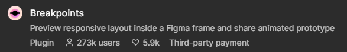

# 📱 Proyek UI/UX Design yang Responsive, Variabel Dinamis, dan Prototyping

## 📝 Deskripsi Singkat
Peserta akan merancang UI/UX dengan menerapkan materi yang telah dipelajari, yaitu responsive design, Figma variables, dan prototyping. Hasil akhir berupa rancangan UI/UX Design.

---

## 🎯 Tujuan Proyek
1. Membuat desain **Responsive**.
2. Mengimplementasikan **Figma Variables**
3. Membuat **Prototype** dari hasil desain.

---

## 📚 Petunjuk Umum Pengerjaan
- [x] Pelajari kembali materi Learning Series 1 – 4 (lihat di Instagram: [@gdgoc.unesa](https://instagram.com/gdgoc.unesa)).
- [x] Tentukan jenis Design UI/UX yang ingin dirancang (edukasi, kesehatan, produktivitas, dll).

## 🎨 Petunjuk Responsive Design
1. Pilih ukuran **Frame Mobile** dan **Frame Desktop**
2. untuk mengatur responsive di ukuran layar antara frame mobile dan frame desktop, gunakan fitur **Auto Layout** 
3. Atur breakpoint, untuk menghubungkan responsive antara frame mobile dan desktop, boleh menggunakan Plugin. 
    - Rekomendasi plugin : **Breakpoint**
    - 
    - [Link Plugin](https://www.figma.com/community/plugin/824289601590456356)
4. [Link Video Belajar](https://youtube.com/playlist?list=PLorlSM7MW5c_rT2WQ-I4VMb-EakmYJDxx&si=PF7Uy6prNAzAuGbf)

## 🎨 Petunjuk Figma Variable
1. Gunakan **Variabel** untuk pengaturan warna, teks, ukuran, dan lainnya.
2. Beberapa Contoh Implementasi variabel
    - Membuat Light Mode & Dark Mode
    - Mengubah bahasa
    - Perhitungan (Checkout, Price, dll)
    - Toggle
3. [Link Video Belajar](https://youtube.com/playlist?list=PLorlSM7MW5c-wHdurDi6ExDdIVE4ZYiJ_&si=MWUvWqYjfRWjvDwu)

## 🌠 Petunjuk Prototyping
1. Buat **Prototype** sesuai fitur yang ada
2. Hubungkan Tiap Frame berdasarkan alur design ui/ux
3. Implementasikan juga Interactive Prototype seperti,
    - dropdown
    - slider
    - tombol volume, dsb.
4. [Link Video Belajar](https://youtube.com/playlist?list=PLorlSM7MW5c8DpnRbAQZHXyp5pPjqn3bA&si=6q3MTo-wHbGyLf99)

## 🍃 Petunjuk Deskripsi
1. Menyusun deskripsi singkat proyek
2. Points yang harus dijelaskan:
    - jenis Design UI/UX yang telah dirancang (edukasi, kesehatan, produktivitas, dll)?
    - Fitur yang ada?
    - Frame apa yang digunakan?, ukuran berapa?
    - plugin apa saja yang digunakan?
    - bagaimana petunjuk dari pembuat terhadap design ui/ux, untuk kami melakukan testing terhadap responsive design yang telah dibuat?
    - variable yang digunakan apa saja?
    - Variable diimplementasikan untuk apa?
    - interactive prototype yang dibuat apa saja?
    - Hal keren lain yang bisa dijelaskan
3. Simpan dalam bentuk .pdf, 
    - format nama file yaitu: nama_uiux_namaDesignUIUXyangdirancang
    - contoh: Lukman_uiux_VirtuLab
